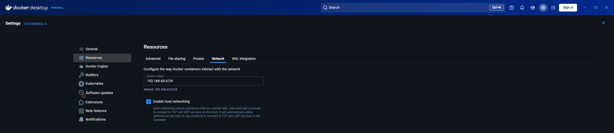
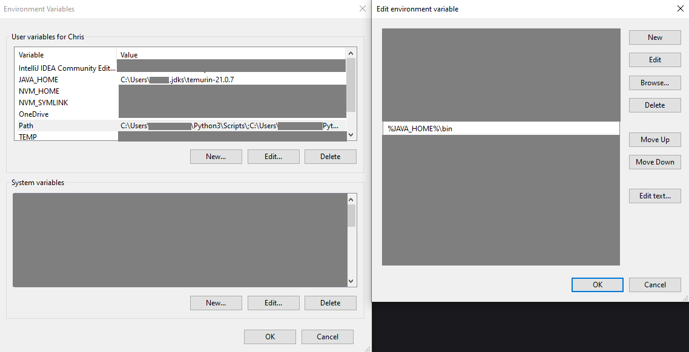

<!-- TOC -->
* [Introduction](#introduction)
* [Tech stack](#tech-stack)
  * [Docker](#docker)
    * [Linux steup](#linux-steup)
      * [Bundled installation (with Docker Desktop)](#bundled-installation-with-docker-desktop)
      * [Manual installation (without Docker Desktop)](#manual-installation-without-docker-desktop)
    * [Windows setup](#windows-setup)
      * [Docker Desktop](#docker-desktop)
  * [node, npm and nvm](#node-npm-and-nvm)
    * [Linux and Windows setup](#linux-and-windows-setup)
  * [JDK 21 (Java Development Kit)](#jdk-21-java-development-kit)
    * [Linux](#linux)
    * [Windows](#windows)
* [Starting the application](#starting-the-application)
  * [Compiling the backend](#compiling-the-backend)
  * [Building the backend docker image](#building-the-backend-docker-image)
  * [Running all containers](#running-all-containers)
    * [Running the backend locally](#running-the-backend-locally)
  * [Starting the frontend (with nodejs)](#starting-the-frontend-with-nodejs)
  * [Starting the frontend (statically)](#starting-the-frontend-statically)
<!-- TOC -->

# Introduction

This Project is a Sudoku website made to casually play, create and share sudokus.  
It uses `nodejs` to serve a static multi-page website written fully in HTML, JavaScript and CSS.  
The other components are run in a Docker container, more to them in their respective sections.

# Tech stack

## Docker

Docker is a nice and easy way to run any application independent of the underlying OS.
So we decided to use Docker to start all the components needed.

### Linux steup

#### Bundled installation (with Docker Desktop)

Docker Desktop can be installed but didn't work for us, as the application starts but could not be used further.  
As Docker Desktop installs all useful Docker components, you might as well give it a
shot: [Docker Desktop official installation guide](https://docs.docker.com/desktop/setup/install/linux/)  
***NOTE:***  
If you face issues with the backend or keycloak not being reachable, when using Docker Desktop, it is most likely because it does not route your machines `localhost` to the VMs `localhost`.
In this case just enable the setting `Enable host networking`:


In case Docker Desktop did not work, you can refer to
the [Manual installation](#manual-installation-without-docker-desktop) Section.


#### Manual installation (without Docker Desktop)

First you need the Docker Engine to run docker containers on your local machine.  
For any linux distribution we recommend Installing the docker engine
directly: [Docker Engine official installation guide](https://docs.docker.com/engine/install/)

Secondly we use a docker compose to start all the containers including the database (`postgres`), `keycloak` and the
backend (`spring boot application`) with only one command.  
So to start everything a lot easier you should be installing Docker
Compose: [Docker compose official installation guide](https://docs.docker.com/desktop/setup/install/linux/)

### Windows setup

#### Docker Desktop

On Windows installing Docker Desktop is by far the easiest way to get the Docker Engine and Docker Compose.  
You can find the official installation guide [here](https://docs.docker.com/desktop/setup/install/windows-install/).

## node, npm and nvm

### Linux and Windows setup

For both Linux and Windows you can simply follow the official
guide: [Official installation guide](https://docs.npmjs.com/downloading-and-installing-node-js-and-npm)

## JDK 21 (Java Development Kit)

Our backend is written in Java, but we will not provide a Precompiled .jar file (to run it locally) or a prebuilt docker
image (to run it in a docker container).  
In order to run it, you need a JDK to compile and run the backend yourself.

You can install any Java JDK from the [https://jdk.java.net/archive/](OpenJDK archive).  
You will be looking for version 21 as the Backend is using JDK 21.

### Linux

For linux you can just run those commands after installing the JDK.  
You can add both commands in this exact order into your `~/.bashrc` or `~/.profile` files to run it automatically every
time a terminal gets opened.

The `JAVA_HOME` variable is needed for the mvnw script to actually know where the jdk is located.

```bash
export JAVA_HOME=/usr/lib/jvm/java-21-openjdk #this should point to the directory where your jdk has been installed
```

Now you just need to add the `bin` folders path of your jdk to the `PATH`

```bash
export PATH=$PATH:$JAVA_HOME/bin
```

To check if everything is working just run:
```bash
java -version
```

### Windows

You need to edit the environment variables in your windows settings:


As you can see in the image you need to set the folder containing your installed jdk e.g.
`C:\User\username\Downloads\openjdk-21` to the Environment variable `JAVA_HOME` this will tell your pc where the jdk is located.  

Now you only need to edit the PATH and add a new section to it:
`%JAVA_HOME%\bin`

The bin folder contains everything your pc needs to actually compile and run java code as it contains the java binaries.  
After this setup you just need to open a fresh terminal and run the following command to see if it works.  
```cmd
java -version
```
***NOTE:***  
Only the new terminals will have the new environment variables so all the already opened terminals will not know where your jdk is located and won't work.

# Starting the application

Here we assume you already have git on your pc as writing install guides sucks.
First you need to clone the git repo:
```gitcli
git clone <clone-url>
```

## Compiling the backend

Compiling the backend is straight forward if you managed to do the [JDK 21 setup](#jdk-21-java-development-kit).
Go to the cloned projects `backend` folder:
```bash
cd <path/to/cloned/project>/backend
```

Use the provided maven wrapper to run
```bash
./mvnw clean package -DskipTests
```
We encountered an issue running this on a machine with maven already setup locally, in this case just run:
```bash
mvn clean package -DskipTests
```

## Building the backend docker image

If you want to run the backend in the container and not locally in your command line, you need to build the docker image first.  
Assuming you went through the steps in [Compiling the backend](#compiling-the-backend), and you are still in the backend folder.  
To build the backend docker image you run:
```bash
docker build -t sudoku/backend .
```

## Running all containers

If you want to run all containers (including the backend):
```bash
docker compose up -d
```

***NOTE:***  
The `-d` flag is important as you do want them to run detached from your terminal

if you want to run all containers but not the backend:
```bash
docker compose up -d keycloak postgres
```

### Running the backend locally

This process will run in your terminal, so you will need a second one to run the frontend.  
Assuming you already [compiled the project](#compiling-the-backend) just run:
```bash
./mvnw spring-boot:run
```
or
```bash
mvn spring-boot:run
```

## Starting the frontend (with nodejs)

Assuming you went through the [installation guide for nvm](#node-npm-and-nvm).
You need to go to the projects `Frontend` folder:
```bash
cd <path/to/cloned/project>/Frontend
```

Run to install all dependencies:
```bash
npm install
```

Now just run:
```bash
npm run start #in some cases it uses "serve" instead of "start"
```
Now call `http://localhost:8081` and enjoy the game.

## Starting the frontend (statically)

As this project is a static multi-page website, you can technically run it by copying the filepath of the `startPage.html` and enjoy the game.